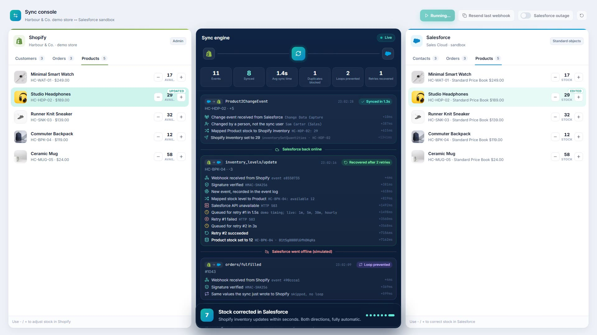

# Shopify + Salesforce Real-Time Sync - Live Demo

Interactive demo of a two-way, real-time sync between Shopify and Salesforce.
Customers, orders and inventory move both ways within seconds.

**Live demo:** https://ricardojose000.github.io/shopify-salesforce-sync-demo/

## What the demo shows

- New customer in Shopify becomes an Account + Contact in Salesforce
- Orders arrive with their Order Products, stock levels follow
- A webhook delivered twice is only processed once
- Changes made in Salesforce flow back to Shopify, and the echo is skipped (no loops)
- Salesforce outage: changes wait in a retry queue with back-off, then catch up

## How the real build works

- Shopify webhooks (HMAC verified) -> sync service -> Salesforce REST API, upsert by Shopify ID
- Salesforce Change Data Capture -> sync service -> Shopify Admin API
- Event log for duplicate blocking, ID map, retry queue, and a plain sync rules file

Both platforms are simulated in the browser here so it's safe to click anything.
The sync rules are the same ones used in the real build.
